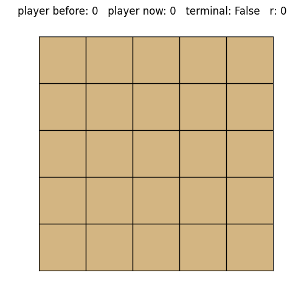

# AlphaZero for Gobang



## Project Structure

The `alphazero_gobang` project is organized into several key components to ensure modularity and maintainability. Below is an overview of the directory structure and an explanation of each component:

### Source Code (`src/`)
All core source code is contained within the `src/` directory, organized into specific modules:

#### `environment/`
This module contains the game environment implementation for Gobang. It includes the board representation, game rules, and a function that handles pitting between the updated and the old network. The code structure consists of two classes: Environment and Gobang_Env. The Environment class serves as a higher-level manager, handling interactions, game logic, and pitting between different agents. On the other hand, the Gobang_Env class encapsulates the lower-level details of the Gobang game environment, managing the board state, legal actions, and game mechanics.

#### `mcts/`
The Monte Carlo Tree Search (MCTS) module contains all relevant functions to create and search a tree. Search is guided by a neural network, hereby the upper confidence bound algorithm is used to balance between exploration and exploitation.

#### `model/`
The neural network model module includes a class called *NeuralNetwork* managing initialization, storage, inference and training of a neural netork and a class called *DatasetGenerator* handling preprocessing the training data.

The neural network gets a single board state as input and tries to estimate the coresponding move probabilities and state value. 
- **Input:** The input shape depends on the size of the board. As each tile can be in one of three sates (player 1, player 2, empty) the input is one-hottet (width, height, 3).
- **Output:** The move probabilities are encoded in an array of shape (width*height). The two **loss-functions** being used are *categorical crossentropy* (move probabilities) and *mean squared error* (state value). 

#### `training/`
This module covers the training pipeline for the AlphaZero model. Everything comes together here to hopefully learn something.

#### `play/`
The playing module provides options for interacting with the trained model by playing against it.

#### `utils/`
The utils module contains a collection of smaller tools for loading and saving the dataset and creating visulizations.

### Configuration and Entry Point
- **`main.py`:** The entry point for both training the model and playing the game

- **Configuration:** All parameters concerning environment, mcts, model and training can be found in `config.py`

- **Data:** Everything from weights, models, visualization and experience datasets is stored in the `/data` folder.

## How to Use
### Installation

1. Clone the repository:

   ```bash
   git clone https://github.com/lucasld/alphazero_gobang.git
   ```
2. Navigate to the project directory:
   ```bash
   cd alphazero_gobang
   ```
3. Install the required packages (possibly activate/create venv):
   ```bash
   pip install -r requirements.txt
   ```
### Training
To train the model, run:
```bash
python main.py --train
```
Find visualisation of some of the self-play games in `/data/visualisations`, your trained model and a plot showing training progress in `/data/models_and_weights`.

### Playing
To play against the model, run:
```bash
python main.py --play
```
This game will be added to the experience if the *experience path* in the *game* section of `config.py`!
